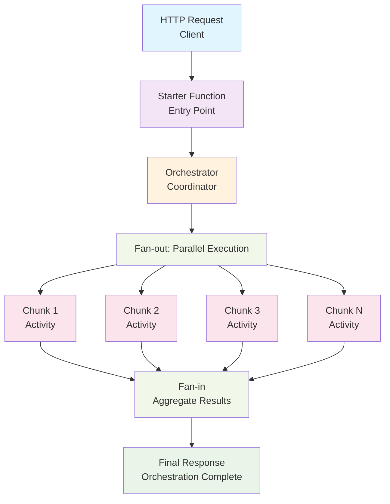
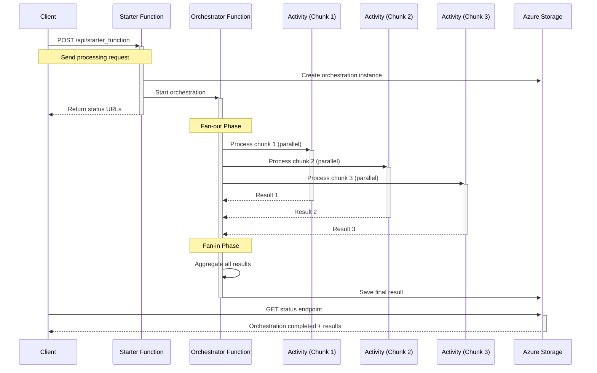
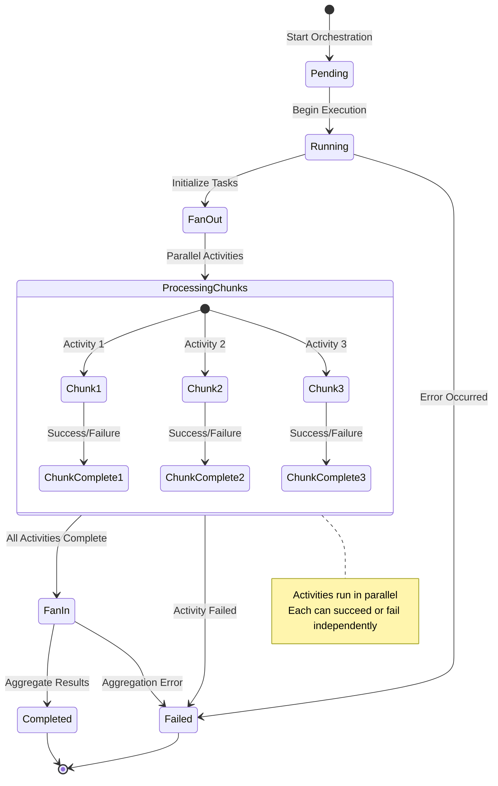
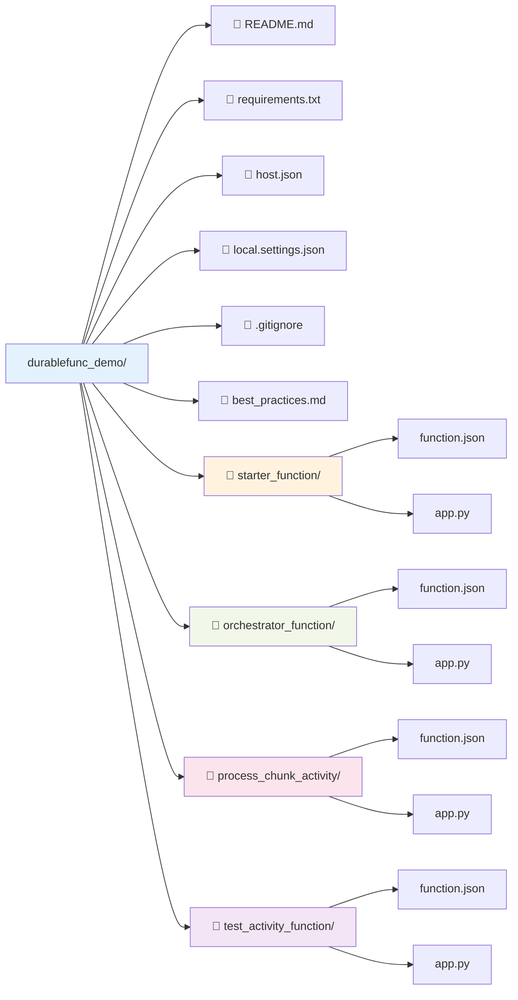

# Azure Durable Functions Demo - Python

A comprehensive demonstration of Azure Durable Functions using Python, showcasing parallel processing patterns, orchestration workflows, and local development with Azurite.

## 📋 Overview

This project demonstrates the **fan-out/fan-in pattern** for parallel processing using Azure Durable Functions. The orchestrator receives a list of data chunks and processes them concurrently, then aggregates the results - perfect for batch processing, data transformation, or any scenario requiring parallel execution with coordination.

### 🎯 Demo Use Case

**Parallel Data Processing Pipeline:**
1. **Client Function** (`starter_function`) - HTTP-triggered entry point that starts the orchestration
2. **Orchestrator Function** (`orchestrator_function`) - Coordinates parallel processing of multiple data chunks
3. **Activity Function** (`process_chunk_activity`) - Processes individual data chunks in parallel
4. **Monitoring** - Track progress and results through durable function status endpoints

## 🏗️ Architecture



### � Execution Flow



### 🔄 Orchestration Lifecycle



## 🚀 Getting Started

### Prerequisites

- **Python 3.8+** 
- **Azure Functions Core Tools v4** 
- **Azure Storage Emulator (Azurite)** 
- **VS Code** (recommended with Azure Functions extension)

### 📦 Installation

1. **Clone the repository:**
```bash
git clone <your-repo-url>
cd durablefunc_demo
```

2. **Create and activate virtual environment:**
```bash
python -m venv .venv

# On macOS/Linux:
source .venv/bin/activate

# On Windows:
.venv\Scripts\activate
```

3. **Install dependencies:**
```bash
pip install -r requirements.txt
```

### 🔧 Local Development Setup

#### Option 1: Using Azurite (Recommended)

**Install Azurite globally:**
```bash
npm install -g azurite
```

**Start Azurite storage emulator:**
```bash
# Start Azurite with custom workspace (run this in a separate terminal)
azurite --silent --location ./azurite-workspace --debug ./azurite-workspace/debug.log
```

**Verify Azurite is running:**
- Blob service: `http://127.0.0.1:10000`
- Queue service: `http://127.0.0.1:10001`  
- Table service: `http://127.0.0.1:10002`

#### Option 2: Using Docker

```bash
# Start Azurite with Docker
docker run -p 10000:10000 -p 10001:10001 -p 10002:10002 \
  -v azurite-data:/data \
  mcr.microsoft.com/azure-storage/azurite
```

### ▶️ Running the Project

1. **Start the Azure Functions runtime:**
```bash
# Make sure Azurite is running first!
func start
```

2. **Expected output:**
```
Azure Functions Core Tools
Core Tools Version:       4.x.x
Function Runtime Version: 4.x.x

Functions:
- orchestrator_function: orchestrationTrigger
- process_chunk_activity: activityTrigger  
- starter_function: httpTrigger

For detailed output, run func with --verbose flag.
[2025-06-17T10:15:00.000] Host started
[2025-06-17T10:15:00.000] Job host started
```

3. **Test the functions:**
```bash
# Trigger the orchestration
curl -X POST "http://localhost:7071/api/starter_function" \
  -H "Content-Type: application/json" \
  -d '{
    "start": "2025-06-17T10:00:00Z",
    "end": "2025-06-17T11:00:00Z", 
    "total_chunks": 5,
    "time": "2025-06-17T10:00:00Z"
  }'
```

## 📖 Usage Examples

### Basic Orchestration

**Start a new orchestration:**
```bash
curl -X POST http://localhost:7071/api/starter_function \
  -H "Content-Type: application/json" \
  -d '{
    "start": "2025-06-17T09:00:00Z",
    "end": "2025-06-17T17:00:00Z",
    "total_chunks": 3,
    "time": "2025-06-17T09:00:00Z"
  }'
```

**Expected response:**
```json
{
  "id": "abc123def456",
  "statusQueryGetUri": "http://localhost:7071/runtime/webhooks/durabletask/instances/abc123def456",
  "sendEventPostUri": "http://localhost:7071/runtime/webhooks/durabletask/instances/abc123def456/raiseEvent/{eventName}",
  "terminatePostUri": "http://localhost:7071/runtime/webhooks/durabletask/instances/abc123def456/terminate",
  "rewindPostUri": "http://localhost:7071/runtime/webhooks/durabletask/instances/abc123def456/rewind"
}
```

### Monitoring Orchestration Status

**Check orchestration status:**
```bash
curl http://localhost:7071/runtime/webhooks/durabletask/instances/{instanceId}
```

**Status responses:**

**Running:**
```json
{
  "name": "orchestrator_function",
  "instanceId": "abc123def456",
  "runtimeStatus": "Running",
  "input": {...},
  "createdTime": "2025-06-17T10:00:00Z",
  "lastUpdatedTime": "2025-06-17T10:00:05Z"
}
```

**Completed:**
```json
{
  "name": "orchestrator_function", 
  "instanceId": "abc123def456",
  "runtimeStatus": "Completed",
  "input": {...},
  "output": {
    "status": "completed",
    "total_chunks": 3,
    "results": [
      {"chunk_id": 0, "status": "success", "processing_time": 2.1},
      {"chunk_id": 1, "status": "success", "processing_time": 1.8},
      {"chunk_id": 2, "status": "success", "processing_time": 2.3}
    ]
  },
  "createdTime": "2025-06-17T10:00:00Z",
  "lastUpdatedTime": "2025-06-17T10:00:07Z"
}
```

## 🔧 Configuration

### Environment Variables (`local.settings.json`)

```json
{
  "IsEncrypted": false,
  "Values": {
    "AzureWebJobsStorage": "UseDevelopmentStorage=true",
    "FUNCTIONS_WORKER_RUNTIME": "python",
    "FUNCTIONS_EXTENSION_VERSION": "~4"
  },
  "Host": {
    "LocalHttpPort": 7071,
    "CORS": "*"
  }
}
```

### Durable Functions Configuration (`host.json`)

```json
{
  "version": "2.0",
  "functionTimeout": "00:05:00",
  "logging": {
    "applicationInsights": {
      "samplingSettings": {
        "isEnabled": true
      }
    }
  },
  "extensionBundle": {
    "id": "Microsoft.Azure.Functions.ExtensionBundle", 
    "version": "[2.*, 3.0.0)"
  },
  "extensions": {
    "durableTask": {
      "hubName": "DurableFuncDemo"
    }
  }
}
```

## 📁 Project Structure



## 🧪 Testing

### Manual Testing

**Test individual activity function:**
```bash
curl -X POST "http://localhost:7071/api/test_activity_function" \
  -H "Content-Type: application/json" \
  -d '{
    "chunk_id": 1,
    "start": "2025-06-17T10:00:00Z",
    "end": "2025-06-17T11:00:00Z",
    "total_chunks": 1,
    "time": "2025-06-17T10:00:00Z"
  }'
```

### Unit Testing

```bash
# Install testing dependencies
pip install pytest pytest-asyncio

# Run tests (when implemented)
pytest tests/
```

## 🚨 Troubleshooting

### Common Issues

**❌ "No storage account connection found"**
```bash
# Solution: Make sure Azurite is running
azurite --silent --location ./azurite-workspace
```

**❌ "Function not found" errors**
```bash
# Solution: Check function.json files and ensure proper binding configuration
func start --verbose
```

**❌ "Instance not found" for status queries**
```bash
# Solution: Use the correct instance ID from the starter function response
# Check the statusQueryGetUri from the orchestration start response
```

**❌ Import errors or module not found**
```bash
# Solution: Ensure virtual environment is activated and dependencies installed
source .venv/bin/activate  # or .venv\Scripts\activate on Windows
pip install -r requirements.txt
```

### Debug Mode

**Enable verbose logging:**
```bash
func start --verbose
```

**Check Azurite logs:**
```bash
# Azurite logs are written to the debug file
tail -f ./azurite-workspace/debug.log
```

## 🔗 Key Features Demonstrated

- ✅ **Fan-out/Fan-in Pattern** - Parallel processing with result aggregation
- ✅ **Deterministic Orchestrations** - Reliable state management and replay
- ✅ **Error Handling** - Graceful handling of activity failures
- ✅ **Local Development** - Complete local testing with Azurite
- ✅ **Status Monitoring** - Built-in orchestration status endpoints
- ✅ **Async HTTP API Pattern** - Long-running operations with polling
- ✅ **Python Best Practices** - Clean code structure and naming conventions

## 📚 Additional Resources

- [Azure Durable Functions Documentation](https://learn.microsoft.com/en-us/azure/azure-functions/durable/)
- [Azure Functions Python Developer Guide](https://learn.microsoft.com/en-us/azure/azure-functions/functions-reference-python)
- [Azurite Storage Emulator](https://learn.microsoft.com/en-us/azure/storage/common/storage-use-azurite)
- [Best Practices Guide](./best_practices.md) - Detailed best practices for this project

## 🤝 Contributing

1. Fork the repository
2. Create a feature branch (`git checkout -b feature/amazing-feature`)
3. Commit your changes (`git commit -m 'Add amazing feature'`)
4. Push to the branch (`git push origin feature/amazing-feature`)
5. Open a Pull Request

## 📄 License

This project is licensed under the MIT License - see the [LICENSE](LICENSE) file for details.

---

**Happy coding with Azure Durable Functions! 🚀**
